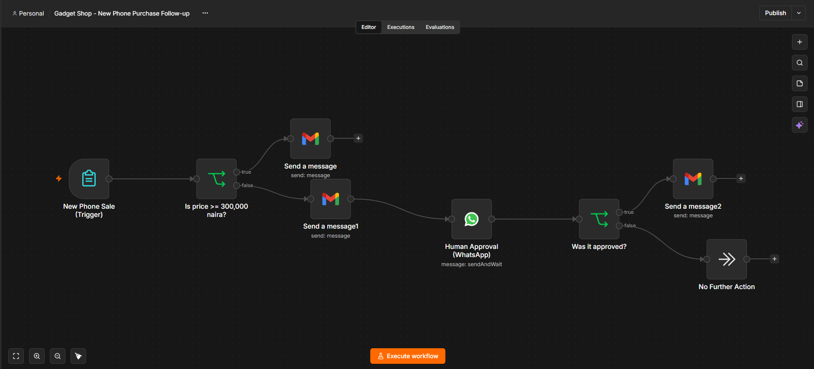
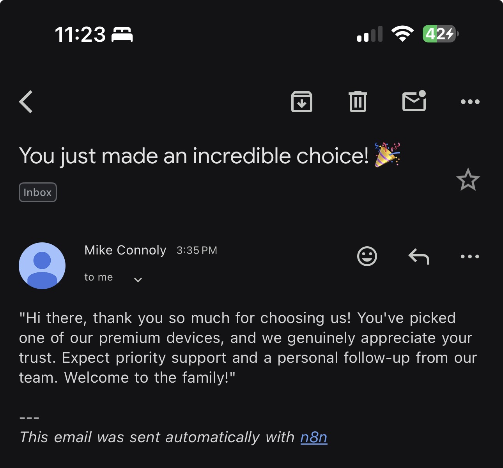
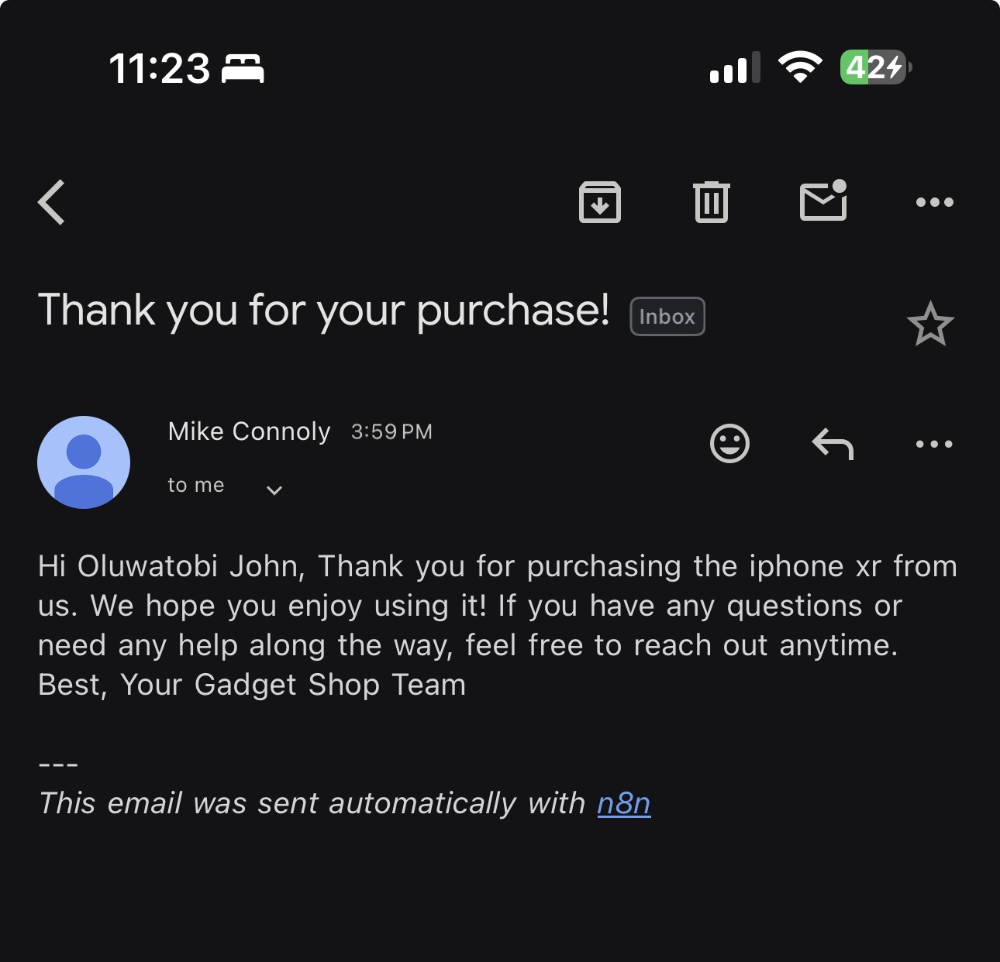
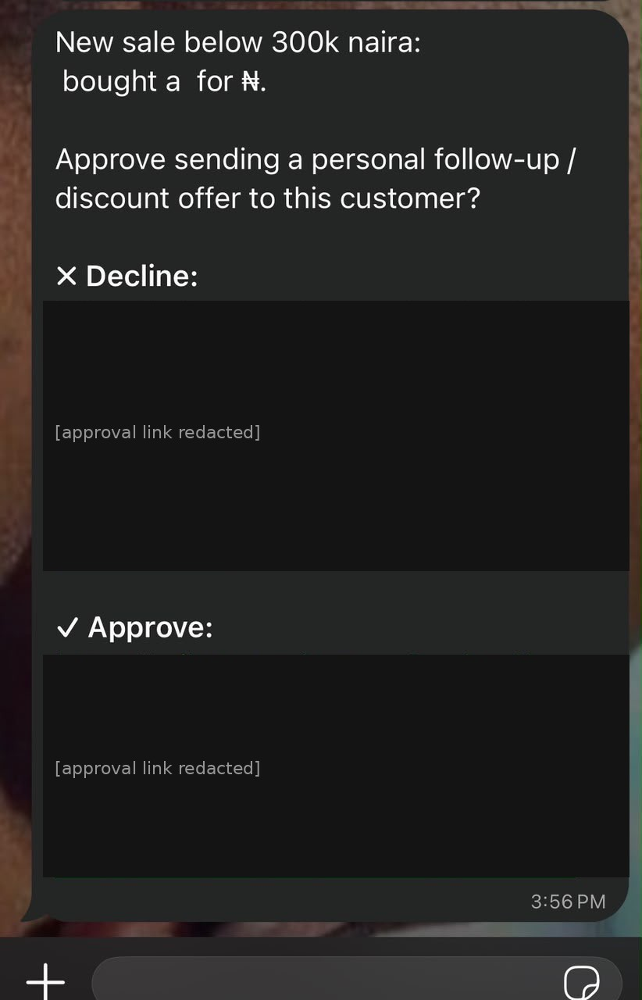
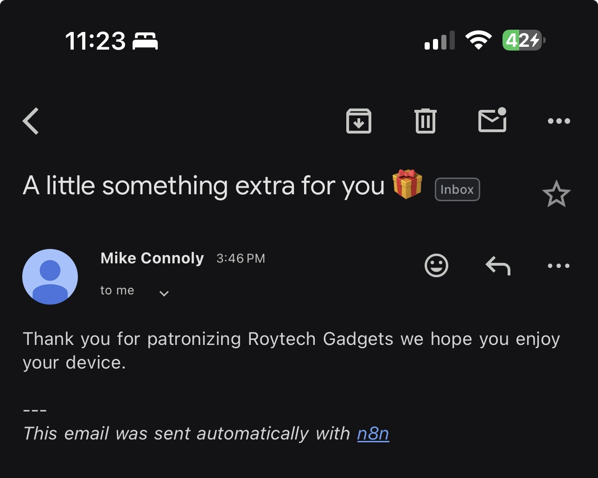

# Gadget Shop — AI-Assisted Sales Follow-Up Automation

An n8n workflow that automatically follows up with customers after a phone
purchase, tailors the message based on order value, and loops in a human for
approval before any personalized outreach goes out — combining traditional
rule-based automation with a human-in-the-loop AI-automation pattern.

## The problem

A small gadget retailer had no consistent way to follow up with customers
after a sale. Every customer got the same (or no) message regardless of how
much they spent, and there was no lightweight way for a sales rep to review
and approve outreach to high-touch customers without manually tracking every
order.

## What this workflow does

1. **Trigger** — A simple form captures a new sale: customer name, email,
   WhatsApp number, phone model, and price.
2. **Condition** — Checks whether the sale is at or above ₦300,000.
3. **Branch A (premium, ≥ ₦300,000)** — Sends an enticing, VIP-toned thank-you
   email automatically. No approval needed; this is a straightforward,
   deterministic path.
4. **Branch B (standard, < ₦300,000)**
   - Sends a lighter, standard thank-you email.
   - Sends a WhatsApp message to the sales rep with the order details and
     Approve / Reject buttons, then **pauses the workflow** until someone
     responds (n8n's native "Send and Wait" pattern).
   - If approved, sends a personalized follow-up email. If rejected, the
     workflow ends with no further action.

**Full workflow canvas (n8n):**



```
                     ┌──────────────────────┐
                     │  ≥ ₦300,000?          │
   New Phone Sale ──►│  (Condition)          │
     (Trigger)       └──────────┬────────────┘
                        YES │         │ NO
                            ▼         ▼
                  Premium Email   Standard Email
                                       │
                                       ▼
                          WhatsApp Approval (pauses)
                                       │
                              ┌────────┴────────┐
                          Approved            Rejected
                              │                    │
                     Personal Follow-up      No Further Action
```

## Screenshots

**Premium branch (≥ ₦300,000) — automatic enticing email:**



**Standard branch (< ₦300,000) — automatic standard email:**



**Human-in-the-loop approval on WhatsApp** (approval links redacted in this
screenshot for security — each link is single-use and tied to a live
execution, so real ones should never be shared publicly):



**Personal follow-up email, sent only after approval:**



## Why this design

- **Traditional automation** (trigger → condition → action) handles the
  deterministic, high-confidence decision — no AI needed to compare a number
  against a threshold.
- **Human-in-the-loop** is used specifically where judgment matters: deciding
  whether a lower-value customer is worth a personal follow-up or discount is
  a business call, not something to fully automate. WhatsApp was chosen as
  the approval channel because it's what the sales team already uses daily,
  so no new tool adoption is required.
- This mirrors a real automation-design pattern: automate the repeatable
  parts, keep a human in the loop for the parts that need judgment, and
  choose the interruption channel based on where the approver already lives.

## Tech stack

- **n8n** (workflow orchestration, both the trigger/condition/action logic
  and the native WhatsApp "Send and Wait for Response" human-in-the-loop node)
- **Gmail API (OAuth)** for transactional email sending
- **Meta WhatsApp Business Cloud API** for the approval message

## How to run this

1. Import `workflow/gadget-shop-workflow.json` into your own n8n instance
   (cloud or self-hosted).
2. Create two credentials:
   - A **Gmail** credential (OAuth sign-in, no app-specific setup required)
   - A **WhatsApp Business Cloud API** credential (Access Token + Business
     Account ID from a Meta developer app — see
     [Meta's WhatsApp Cloud API docs](https://developers.facebook.com/docs/whatsapp/cloud-api))
3. Open the "Human Approval (WhatsApp)" node and set:
   - `phoneNumberId` — your WhatsApp Business phone number ID
   - `recipientPhoneNumber` — the sales rep's WhatsApp number who should
     receive approval requests
4. Open each email node and confirm the Gmail credential is attached.
5. Activate the workflow, or use "Execute workflow" to test manually via the
   built-in form.

## Limitations & what I'd improve next

- **24-hour messaging window**: WhatsApp only allows free-form messages
  (like the Approve/Reject prompt) if the recipient has messaged the
  business number within the last 24 hours. A production version should
  either use a pre-approved message template for the approval prompt, or
  have the flow initiated by the sales rep messaging in first.
- **No persistence/logging**: right now there's no record of past
  approvals/rejections outside of n8n's own execution history. A real
  version would log outcomes to a spreadsheet or lightweight database for
  reporting.
- **Single approver**: currently hardcoded to one WhatsApp number. A next
  iteration could route to whichever rep is on shift, or notify a small
  group.
- **Threshold is static**: ₦300,000 is hardcoded. Could be pulled from a
  config/database so it's adjustable without editing the workflow.

## Background

This was built as a hands-on exercise while learning workflow automation
concepts (triggers, conditions, actions, error handling, human-in-the-loop)
using n8n as the primary tool, then applied to a real small-business use case
for a friend's gadget shop.
